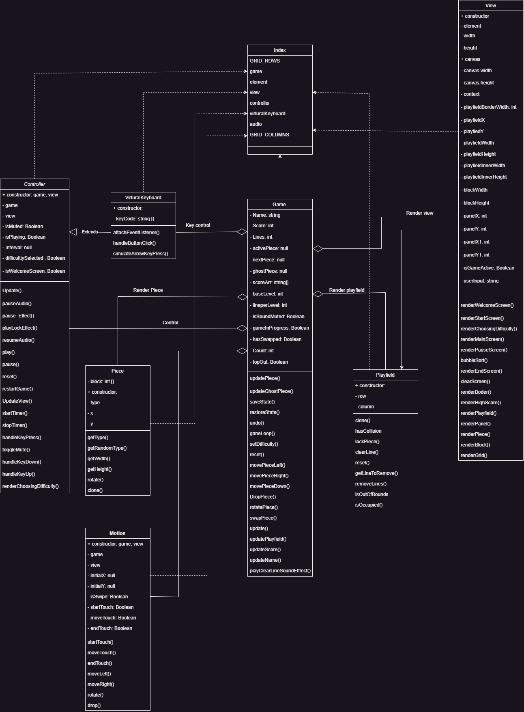
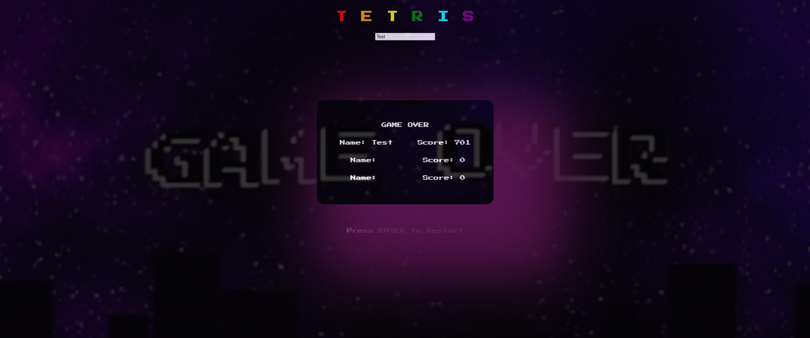
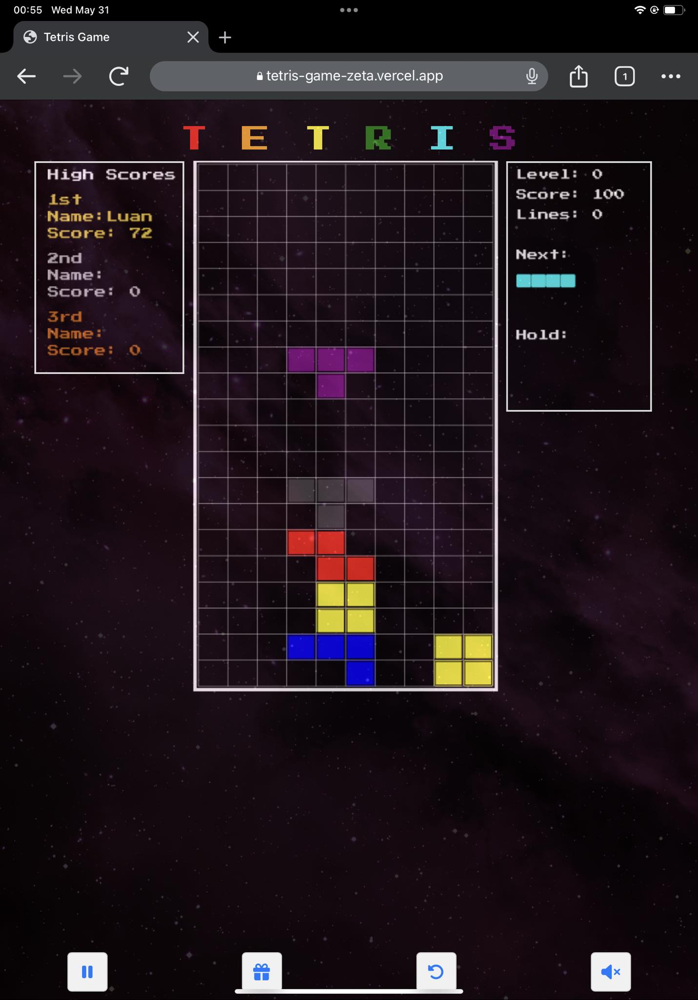

# Tetris Game 
Click here and enjoy the game --> [Tetris Game](tetris-game-zeta.vercel.app)  

## Data Structures and Algorithms Project (Semester 2_2022-2023)

 
 

# Table of contents :round_pushpin:  

1. [Introduction](#introduction)
2. [Feature](#features)
3. [Challenges](#challenges)
4. [UML Class Diagram](#uml)
5. [Demo](#demo)
6. [PowerPoint](#powerPoint)
7. [Installation](#installation)
8. [References](#references)

## Introduction  :smile:
### Group: 9 :star_struck:
### Our team member
| Index | Name                   |     ID      |              Email               | Github account             |
|:------|:-----------------------|:-----------:|:--------------------------------:|:---------------------------|
| 1     | Trần Quang Trí | ITITIU20325 | tranwangtristudy@gmail.com | WangTris |
| 2     | Nguyễn Hoàng Luân | ITITIU20012 | luannguyenn.2k2@gmail.com | naulkun7 |
| 3     | Nguyễn Hoàng Thiên Phúc  | ITITIU20279 | nguyenhoangthienphuc1802@gmail.com |   thienphuc1802 |
| 4     | Trần Ngọc Nhân | ITITIU20264 | nhantran4102002@gmail.com | petertran410 |           

### Tasks and Contribution 
| Index | Role                                                         | Person In Charge | Contribution |
|:------|:-------------------------------------------------------------|:--------------:|:------------:|
| 1     | Leader     |   Hoàng Luân   |          25%      |
| 2     | Member      |   Quang Trí    |          25%      |
| 3     | Member  |  Thiên Phúc     |      25%          |
| 4     | Member |     Ngọc Nhân     |          25%      |  

| Name | Tasks |
|:------|:-------------------------------------------------------------|
| Hoàng Luân     | Overall Framework, Ghostpiece func, Mobile, Set Difficulty func, Miscellaneous   |   
| Quang Trí     | Readme, Holdpiece func, Sound Effect, Miscellaneous     |    
| Thiên Phúc     | Score Board, Class Diagram, Algorithm (Sort), Miscellaneous  |     
| Ngọc Nhân     | Unđo func, Class Diagram, Miscellaneous |      
| All members    | Report, PowerPoint, Front-end |
### Environment :computer:
Language:  

Platform:    
  
 
  

## Features  :star2:
**Main Feature:**  
- Play, Restart, Pause
- Generate piece
- Sound 
- Play field

**Extra feature:**  
- Undo state
- Hold piece
- Next piece
- Ghost piece
- Score board
- Game Speed, Level, Set Difficulty
- UI (Responsive)
- Mobile Support (Ipad only)

**Future feature:**
- User Score Database
- Change color or theme by user
- User ranking
- Optimize for mobile user
- More Game Animation

## Challenges  ✴️
- Most of the team members are not familiar with Web environment
- Problems with the IDE, Canvas
- Problems when applying Data Structures and Algorithms in project
- And some other smaller issues...  

### What we have learned :pencil: 
Soft skills: works in GitHub, Google docs, Google slides,...  
Main skills: Debugs, Team work  
Knowledge: HTML, CSS, JavaScript, Data Structures, Algorithms, UI design, Thesis report, Git and Github Usage

## UML Class Diagram  📄

## Demo   🤖

#### Start Screen 

#### Set Difficulty 

#### Play Screen 

#### Pause Screen 

#### End Screen 

#### Mobile 

### How to play
#### Desktop 🖥️
* Use the 🡸|🡺 to move left and right
* Use the ↑ to rotate 90° clockwise
* Use Space to drop down
* Use C to hold the Piece
* Use U to undo
* Use R to restart

#### Mobile 📱
* Swipe Left and Right to move
* Swipe up or tap to rotate
* Swipe down to drop piece
* Press "||" button to interact
* Press "Gift" button to hold
* Press "Undo" button to undo
* Press "Mute" to toggle mute

## PowerPoint and Report  📖
   Support: Google slides
   (Screen Shot)
   
   Direct: [src)
   
   Support: Google docs
   (Screen Shot)
   
   Direct: 
## Installation  
1. Step 1: Access to https://github.com/naulkun7/Tetris-Game
- Download and unzip the file
- Clone following repository to your local  [Tetris-Game_repository](https://github.com/naulkun7/Tetris-Game.git)     
    + VSCode: Copy the repository URL --> Open VSCode --> Ctrl + Shift + P --> Type "gitcl" --> Choose "Git Clone" and paste the URL in   
    + WebStorm: Copy the repository URL --> Open WebStorm --> Choose "Get from VCS" --> Paste the URL on your clipboard to "URL" field --> Press Enter or Clone
2. Step 2: Choose index.html file in source code  --> Right click and click "Open with Live Server"
3. Step 3: Run or modify it as you want
   
## References  :book:
Thanks to the incredibly rich resources that helped us make this project happen 
1. Data Structures and Algorithms Lectures (Dr. Tran Thanh Tung)
2. Data Structures and Algorithms Labs (MSc. Nguyen Quang Phu)
3. Tetris на JavaScript - CodeDojo: [Link](https://www.youtube.com/playlist?list=PLqHlAwsJRxAMa9HHLRZcHFZyM7SBHqJgt)
